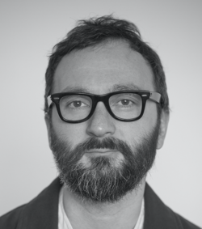

#### VIACHESLAV TYSHCHUK
##### Frontend Developer



---

#### Contacts
* **Location:** Budva, Montenegro
* **Phone:**    +382 (67) 141 689
* **E-mail:**   slava1000uk@gmail.com
* **Telegram:** https://t.me/slava1000uk
* **Github:**   https://github.com/slava1000uk

---

#### About Myself
I imagine a wonderful world of the future in which all routine processes are automated by developers and people are engaged only in what cannot be automated: love and creativity. It deeply inspires me to be part of this change.

#### Hard Skills
Front-end development using: 
* JavaScript
* ReactJS
* HTML
* CSS/ SASS
* Git

#### Code Example
```
function reverseWords(str){
  str = str.split(" ")
            .reverse()
            .join(" ");

  return str; // reverse those words
}

console.log(reverseWords("yoda doesn't speak like this"));
```
#### Relevant Experience
Several pet web applications built with vanilla JS

* [Game Snake](https://slava1000uk.github.io/GameSnake/)
* [Background color changer](https://slava1000uk.github.io/Color-Flipper/)

#### Education
* **University:**
  + Novosibirsk State University,
    Master of Science (MS), Mathematics and Computer Science
    1996 - 2001
  + Russian Academy of Theater Arts       (GITIS), Moscow
   Theater director
   2003 - 2008

* **Courses:**
  + [Htmlacademy HTML, CSS, JavaScript course](https://htmlacademy.ru/courses/new/fe-start)
  + [learn.javascript.ru](learn.javascript.ru)
  + [Udemy React course by Maximilian Schwarzmuller](https://www.udemy.com/course/react-the-complete-guide-incl-redux/)

#### Languages
* Russian (native)
* English (fluent)

#### Soft Skills
All soft skills below are based on my working experience as a professional theater director for 15 years:

* Creativity and problem solving.
* Initiative and willingness to take risks.
* Negotiation.
* Communication skills.
* Collaboration and teamwork.
* Time management skills and respect  for deadlines.
* Research skills.
* Ability to stay motivated and motivate others.
* Team leadership.
* Lifelong learner. Ability to learn fast.
